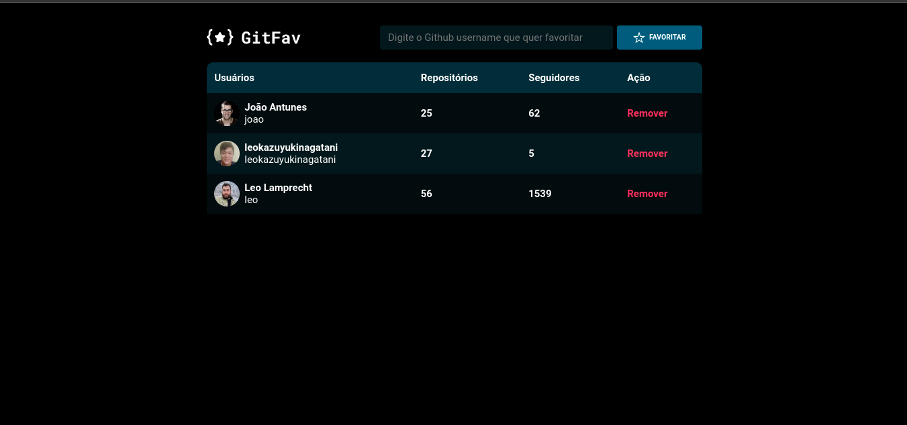

  

## 🚀 Tecnologias

Esse projeto foi desenvolvido com as seguintes tecnologias:

- [HTML](https://developer.mozilla.org/pt-BR/docs/Web/HTML)
- [CSS](https://developer.mozilla.org/pt-BR/docs/Web/CSS)
- [JSS](https://developer.mozilla.org/pt-BR/docs/Web/JavaScript)
## 💻 Projeto

O projeto Focus Timer é uma aplicação que disponibiliza um timer simples com som de fundo, ele foi elaborado nas aulas do stage 05 no programa Explorer da Rocketseat.

## 🔖 Layout

No link abaixo você encontra o layout do projeto web. Lembrando que você precisa ter uma conta no [Figma](http://figma.com/) para acessá-lo.

- [Layout Web](https://www.figma.com/file/ZShUdY5ZamOmDhf3ozzDK2/%5BDesafios-Explorer%5D-GitFav-(Copy)-(Copy)?node-id=104%3A48)
